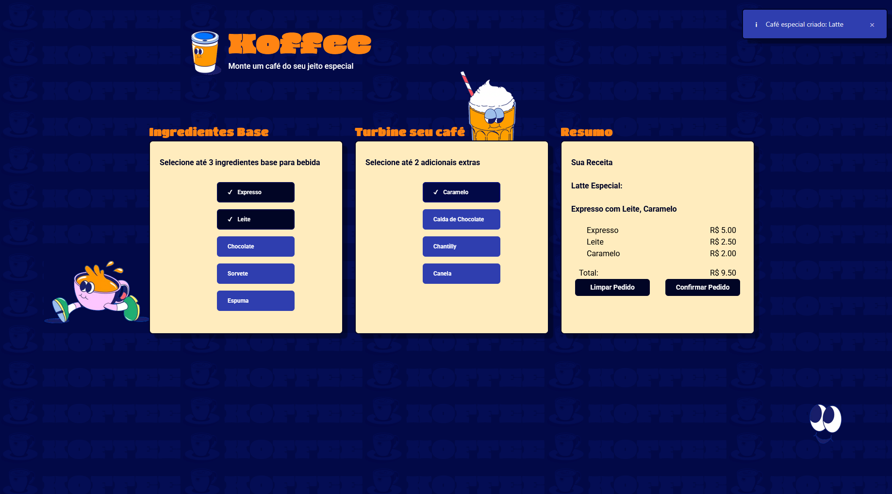

# Koffee ☕

Sistema Web de cafeteria, monte seu café do seu jeito.
App criado para aprendizado de teste unitários E2E e API.



## 🛠️ Tecnologias Utilizadas

- **Frontend**: JavaScript Vanilla (ES6+)
- **Backend**: Node.js
- **Database**: PostgreSQL

## 📦 Instalação

1. Inicie os containers:

```bash
docker-compose up --build
```

2. Rode as migration para inicializar o banco de dados:

```bash
cd backend
npm run migrations
```

## 🧪 Testes de API

### Configuração dos Testes

```bash
# Entre na pasta em que deseja testar
cd backend
ou
cd frontend

# Execute os testes em modo headless
npm run cypress:headless

# Execute os testes com interface gráfica
npm run cypress:web
```
